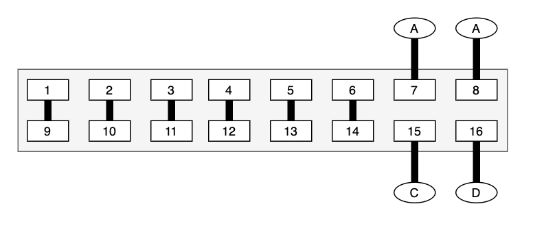
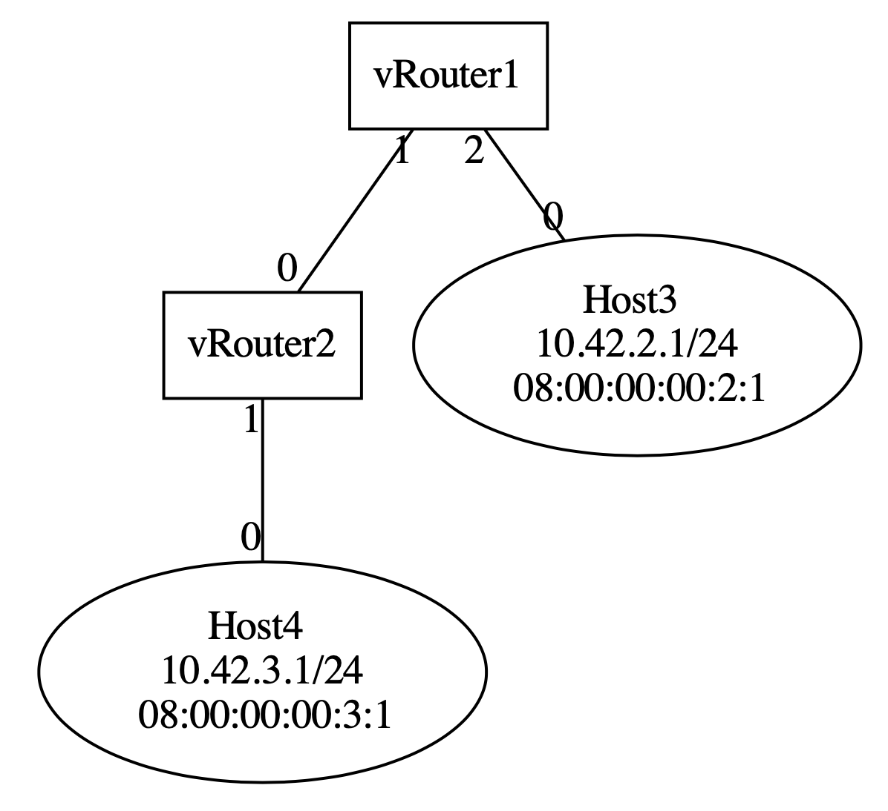
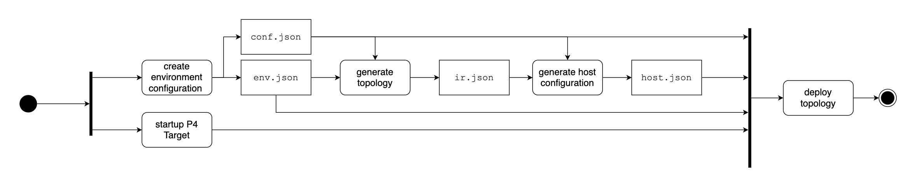

# VirNTUP

Virtualized Network Topologies using P_4 - Interdisciplinary Project at the [Chair of Network Architectures and Services](https://www.net.in.tum.de) during my Masters Degree. (Instructors [@gallenmu](https://github.com/gallenmu/) [@scholzd](https://github.com/scholzd) [@manuel-simon](https://github.com/manuel-simon))

## What is virntup?

Virntup is a proof of concept, to show that virualizing topologies using P4 hardware is actually possible and measuring the performance of virutalized topologies to compare it to their physical counterparts.
While Virntup is a prototype, it is build fully extensible and adaptable. The code is well documented and design documents are provided to simplify the usage and foster further development of the tool. 

The basic idea is, that we use link loops to recirculate packets back into the switch. Imagine we have the following 16-Port P4 Switch, with 6 wire-loops and 4 ports connected to 4 hosts (A,B,C,D). 

And we would like to instantiate the following topology, with two virtual routers and two hosts. 


The system creates a mapping between: 
- target ports <-> vRouters
- wire loops <-> links between vRouters
- real host <-> virtual hosts 

The following two images visualize the mapping.


## Limitations

Currently virnup has the following limitations: 
- Only supports IPv4 
- ARP is not supported, all hosts connected to the virtual topology have to configure their ARP table manually
- ICMP is not supported 
- Up until now only tree-topologies are supported

The P4 implementation (called VirNTUP_4) of the router is very basic. The focus of this project was on the control plane. Due to the modular design of virntup, it should be possible fairly easy to adapt the connector to work with other p4 implementations. 

## Motivation 

Traffic flows in data centers are often of interest for network researchers. However, creating and maintaining network infrastructure of this scale solely for measurements is expensive and tedious to maintain.
Virntup simplifies the process of creating and maintaining data center topologies using programmable P4 switches. Hence defining, instantiating and adapting topologies on the fly becomes possible and fully automatable. 

## Usage

The general virntup deployment workflow is shown in the following UML Activity Diagram: 


We start with a fork node as the setup of the P4 target and the `virntup` setup can be done independently. First, we need to create or provide a `env.json` file, and optionally a `conf.json`.
Using the specified enviroment we use `virntup topogen` to generate the desired topology resulting in an `ir.json` artifact. 
The intermediate representation now forms the input for the `virntup envgen` stage, creating the `host.json` configuration file. 
As soon as all these steps, as well as the `startup P4` target activity are completed, we can deploy the generated topology with `virntup deploy`. 

### Install 
- Clone the repository 
```
git clone --recursive https://github.com/Mtze/virntup_4.git
```
- Crate an virual env and activate it
```bash
virtualenv venv
. venv/bin/activate
```
- Install dependencies 
```
pip3 install -r requirements.txt
```


### Supplemental Files

#### `env.json`
Virntup needs an `env.json` containing the target environment to which a topology should be deployed to. 
The `env.json` contains a list of links to hosts and a list of physical loops between ports. An `env.json` could look similar to this: 

```json 
{
    "host_links" : [
        ["h1", 1],
        ["h2", 2]
    ],

    "links": [
        [3, 4]
    ]
}
```
The `env-setup` repository contains some preconfigured env files to use, as well as further guidance how to write your own. 

#### `P4.info` and `virntup.bin`
Virntup assumes that the P4 target runs/is able to run the `virntup.p4` program. If the target already runs virntup, these files are not necessary to deploy a topology to the target. 
If you prefer to use virntup to deploy the p4 program, you have to provide both the `p4.info` as well as the `virntup.bin` (which was modified to work with P4Runtime, see [here](https://github.com/p4lang/p4runtime-shell#target-specific-support).

The P4 implementation of virntup can be found in the `vrintup-p4-implementation` repository. 


#### Optional `conf.json`
To unclutter the CLI virntup can be fully configured using a `conf.json` containing all the desired options. A `conf.json` example called `test-config.json` can be found in the repository. 

If CLI parameters are provided additionally to the `conf.json` the CLI parameters will be preferred. 

### Example workflow 
> Each command provides a fairly comprehensive help. Try running 
```bash
python3 virntup.py -h
```

- First we need to choose which topology we would like to instantiate. In this case we go for the `minimal` option. 
```bash
python3 virntup.py topogen \
    -t minimal \
    -o ir.json
```
- Virntup now creates an `ir.json` which contains a json representation of the generated toplogy. Have a look at the file, it is quite readable. 

    > Try running `python3 virntup.py topogen -h` for more details

- Now we need to create the host environment. The host environment contains the necessary configuration on each host to work with the virntup topo:
```bash 
python3 virntup.py envgen \
    -e env.json \
    -ir ir.json \
    -o host.json \
    -t bmv2
```
- The generated `host.json` file can be used as an input for the setup scripts in the `testbed-env-setup` repository to configure the test hosts. **This has to be done prior to the deployment step**

- Finally we can deploy the virutal toplogy to the p4 target: 

```bash
python3 virntup.py deploy \
    -e env.json \
    -ir ir.json \
    -t bmv2 \
    --hostname localhost \
    --port 50051 \
    --p4info p4.info.txt \
    --p4binary virntup.json
```
 - Virntup will now deploy the p4 program to the target and add all the necessary table entries. 

### Generated Artefacts 

- `ir.json`
- `host.json`
- `dot_representation.dot`

