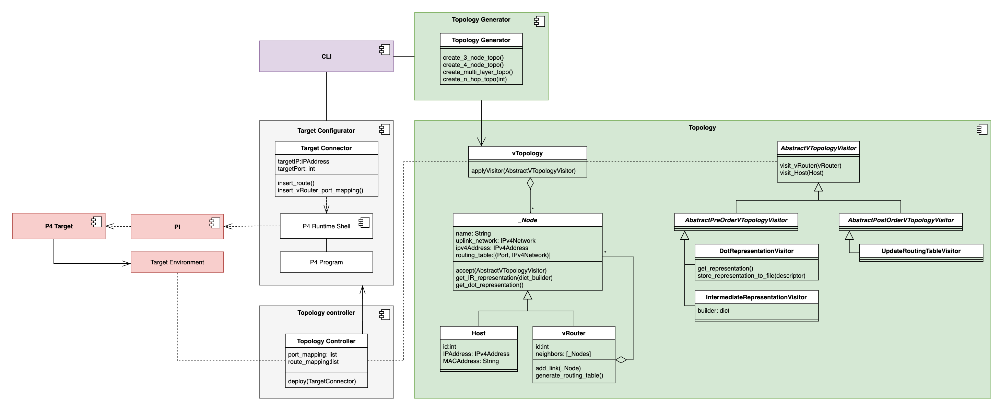
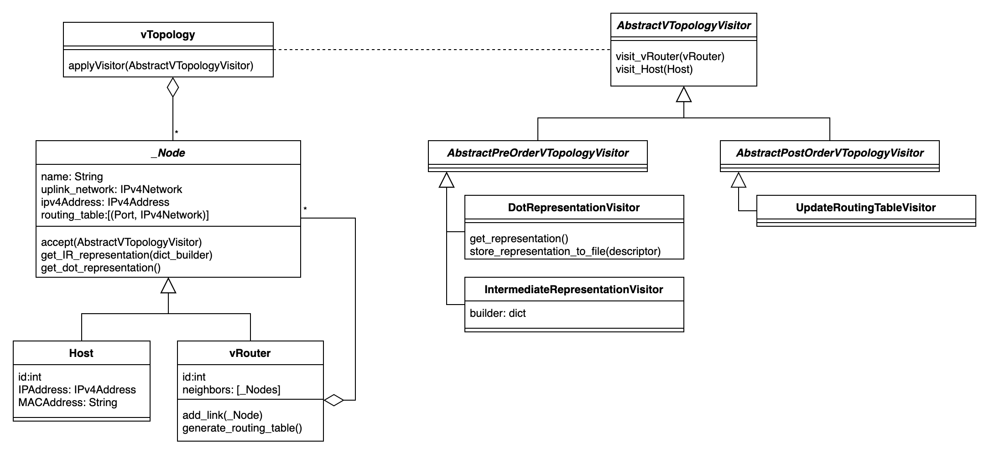
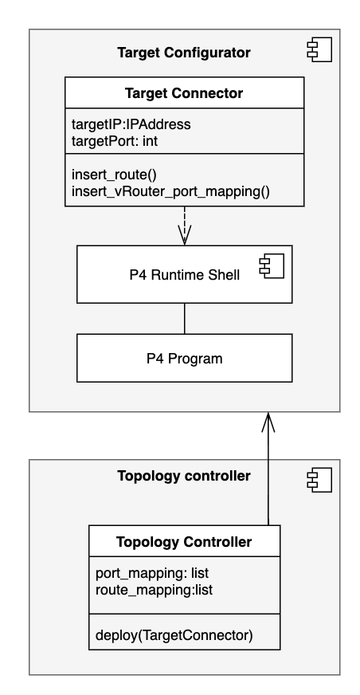
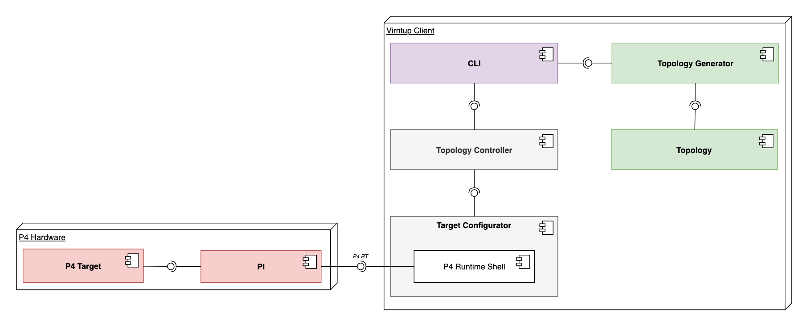

# System Design 

## General Implementation Idea 

### Target Environment
To be able to instantiate a Topology with many virtual router on one target, a way to circulate packets was needed. While P4 has the possbillity to recirculate packets in the Match Action Pipeline, we went for physical wire loops for two reasons: 
  1. It is the strait forward solution to recirculate packets 
  2. It allows wire taping for precises measurements

A physical setup of a P4 Switch used for this project hence could have a wire diagram like this: 
 #TODO

This environment is represented as `env.json` file containing all the loops and connections to hosts: 

```json 
{
    "host_links": [
        ["h1", 3],
        ["h2", 4],
        ["h3", 25]
    ],

    "links": [
        [1,2], 
        [7,8], 
        [9,10], 
        [11,12], 
        [12,13], 
        [13,14], 
        [15,16], 
        [17,18], 
        [19,20], 
        [29,30], 
        [31,32] 
    ]
}
```
> Note, that for the sake of simplicity we used the physical port number on the target. These ports might have different IDs internally. Later we need to use these internal IDs!

### P4 Implementation
> See [here](https://github.com/Mtze/virntup_4) for the P4 implementation. 

## Components 
After carefully reviewing the [Analysis Object Model](analysis.md#analysis-object-model) we came up with the following design: 



We now will discuss each Component in detail. 

### Topology


The `Topology` Subsystem represents a virtual topology and all its entities. The `vTopology` class forms the Interface to the outside and allows interactions with the topology.
Each Topology in virntup is represented as `vTopology` object. A `vTopology` consists of `_Nodes` (which is an abstract class). 
For the sake of this project we limited ourselves to tree-topologies. Hence we incorporated the _Composite Pattern_ for the tree structure. 
In future iterations this might change, but for our purposes trees are sufficient and are easy to handle. 
The tree-root is formed by a `vRouter`. Each `vRouter` can be connected to many `_Node`s (So either `vRouter`s or `Hosts`). A `Host` on the other hand can be connected to exactly one `vRouter`. 

To walk the topology we used another common design pattern: the _visitor pattern_. Each `_Node` has an `accept(visitor)` method which specifies the walk behavior. 
The `AbstractVTopologyvisitor` taxonomy on the right shows the currently available visitors. These visitors are used to generate the Dot-visualtization as well as the generation of the Intermediate representation. 
By using the visitor pattern, we achieved great extensibility as new visitors can be added easily. 


### Topology Generator


### Topology Controller and Target Configurator




# Deployment 


