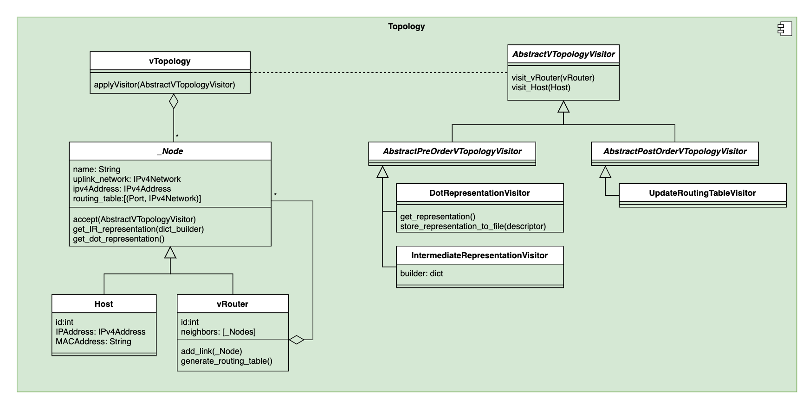

# System Design 

## General Implementation Idea 

### Target Environment
To be able to instantiate a Topology with many virtual router on one target, a way to circulate packets was needed. While P4 has the possbillity to recirculate packets in the Match Action Pipeline, we went for physical wire loops for two reasons: 
  1. It is the strait forward solution to recirculate packets 
  2. It allows wire taping for precises measurements

A physical setup of a P4 Switch used for this project hence could have a wire diagram like this: 
 #TODO

This environment is represented as `env.json` file containing all the loops and connections to hosts: 

```json 
{
    "host_links": [
        ["h1", 3],
        ["h2", 4],
        ["h3", 25]
    ],

    "links":
        [1,2], 
        [7,8], 
        [9,10], 
        [11,12], 
        [12,13], 
        [13,14], 
        [15,16], 
        [17,18], 
        [19,20], 
        [29,30], 
        [31,32] 
}
```
> Note, that for the sake of simplicity we used the physical port number on the target. These ports might have different IDs internally. Later we need to use these internal IDs!

### P4 Implementation
> See [here](https://github.com/Mtze/virntup_4) for the P4 implementation

## Components 


### Topology




### Topology Generator


### Topology Controller and Target Configurator


# Deployment 


